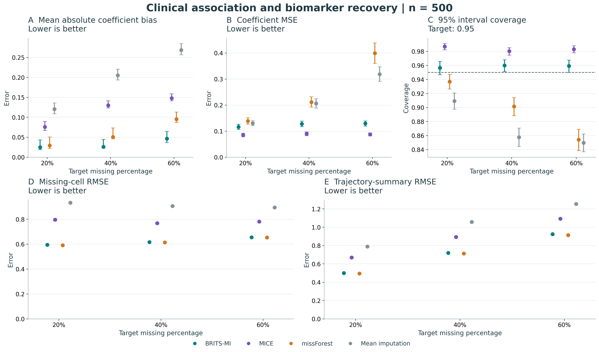
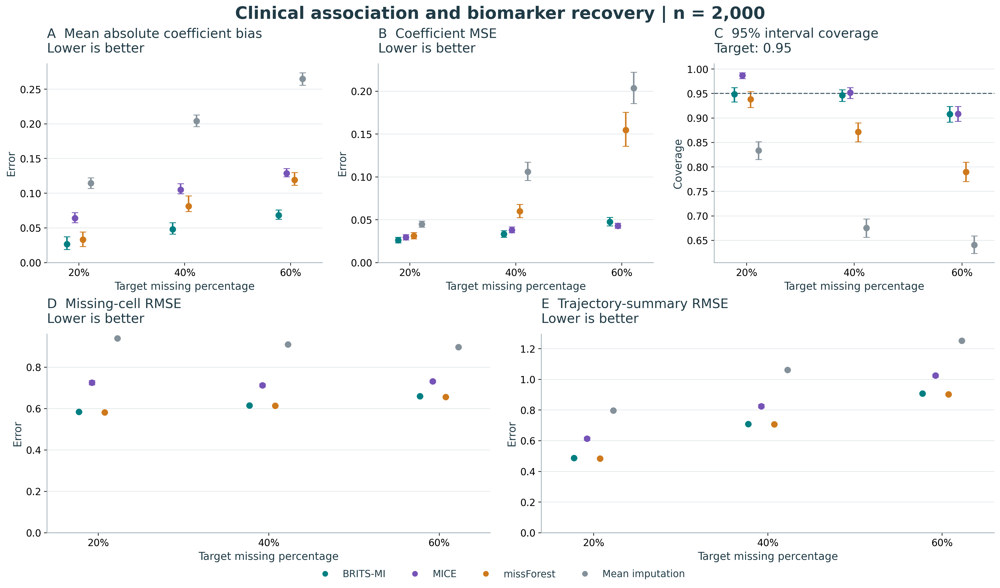
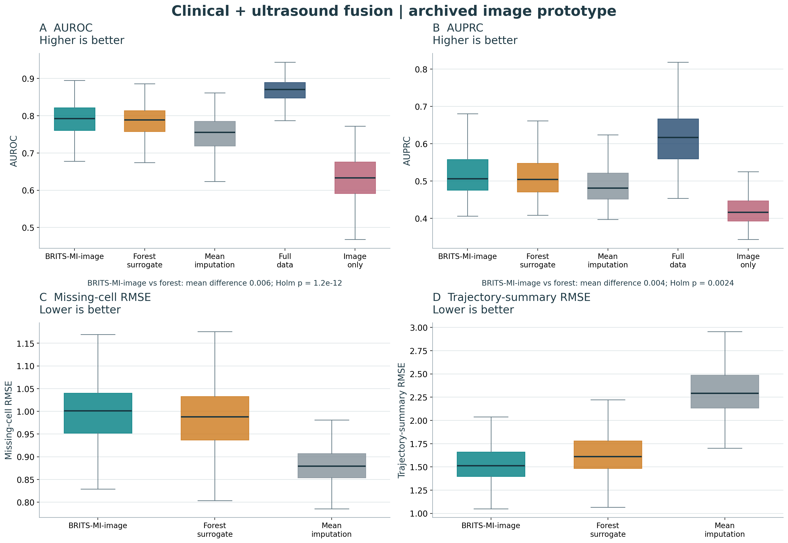
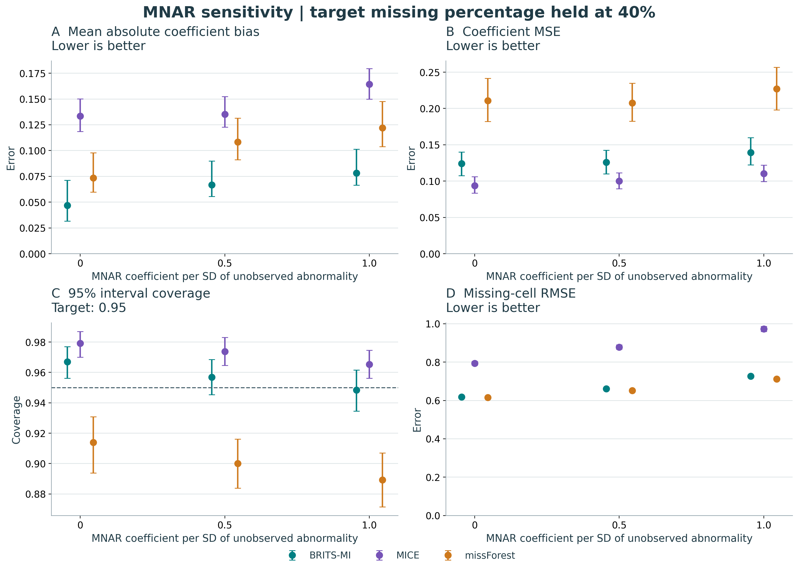
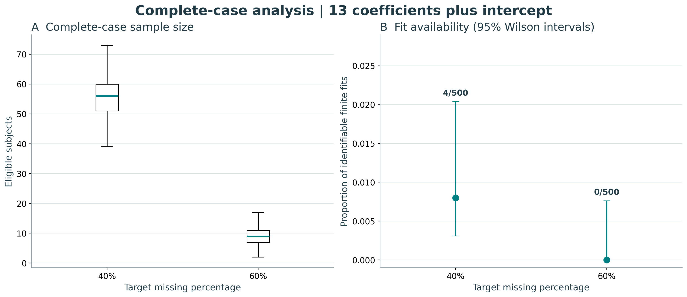

# Simulation visualizations

Rebuild all figures and associated plot tables from the repository root:

```bash
python simulation/plot_results.py
```

Each figure is available as a preview PNG, vector PDF, and editable vector SVG.
No training or private clinical records are required. [Full captions and experiment
settings](../README.md) describe completed replication and metric definitions.

## Clinical association



[PDF](clinical_n500.pdf) | [SVG](clinical_n500.svg) | [Plot data](clinical_n500_plot_data.csv)

Points and Monte Carlo intervals summarize 200 replicates per missing percentage.
Coverage targets 0.95; lower error is preferable. Missing-cell and trajectory
errors are RMSE, not NRMSE.

## Larger-sample association



[PDF](clinical_n2000.pdf) | [SVG](clinical_n2000.svg) | [Plot data](clinical_n2000_plot_data.csv)

Same metrics and method colors; 100 replicates per missing percentage.

## Clinical-image fusion



[PDF](image_fusion.pdf) | [SVG](image_fusion.svg) | [Plot data](image_plot_data.csv) |
[Matched pairwise tests](image_paired_tests.csv)

Boxplots summarize 500 replicates. The image experiment evaluates a tree-based
BRITS-MI-image extension and a forest surrogate. The historical invalid MICE arm
and zero-fill are not displayed. Boxes show the interquartile range with median
lines; whiskers use the 1.5-IQR convention. Pairwise tests compare BRITS-MI-image
with the two practical comparators, with Holm adjustment across four tests.

## MNAR sensitivity



[PDF](mnar_sensitivity.pdf) | [SVG](mnar_sensitivity.svg) |
[Plot data](../results/mnar/summary_with_monte_carlo_uncertainty.csv)

One hundred replicates at each MNAR coefficient; target missing percentage stays
at 40%. The horizontal coordinate changes the dependence on unobserved biomarker
abnormality rather than increasing the marginal missing percentage.

## Complete-case fit availability



[PDF](complete_case.pdf) | [SVG](complete_case.svg) |
[Every attempted fit](../results/complete_case/fit_audit.csv)

Five hundred attempts at each missing percentage; 4 valid fits at 40% and none
at 60%. Error bars on fit availability are 95% Wilson intervals. These are not
coefficient coverage estimates. The boxplots show the eligible sample sizes.

Source CSV checksums are recorded in [source_hashes.json](source_hashes.json).
